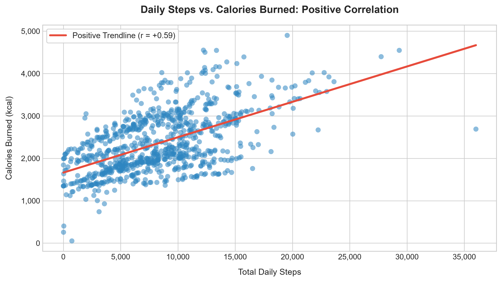
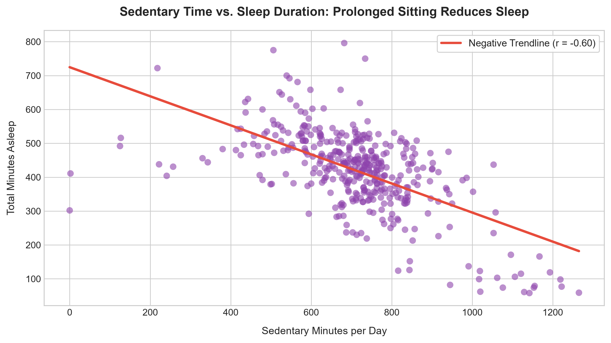
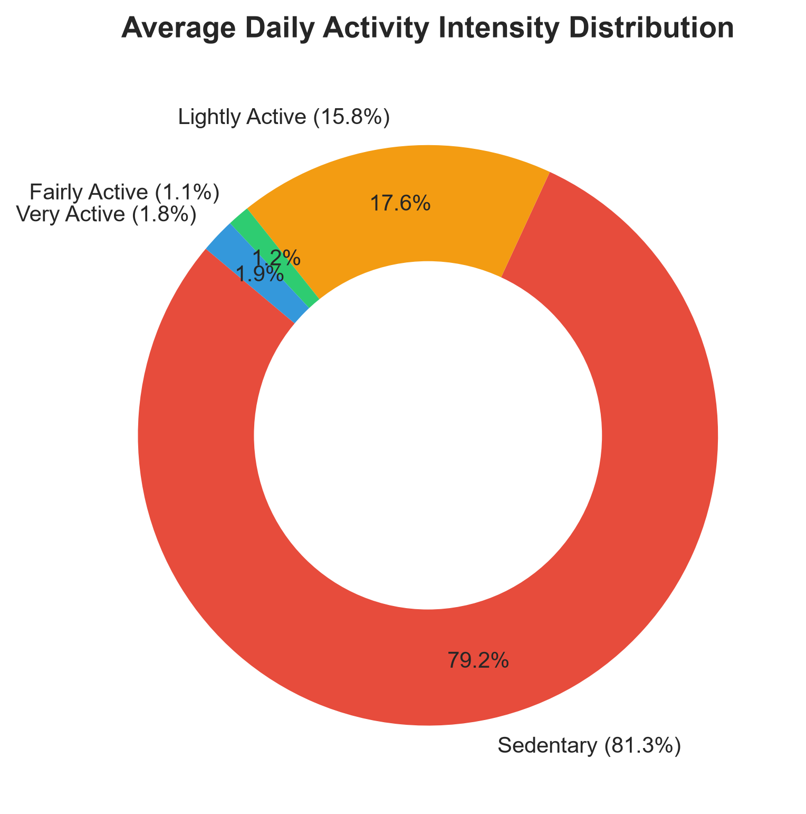
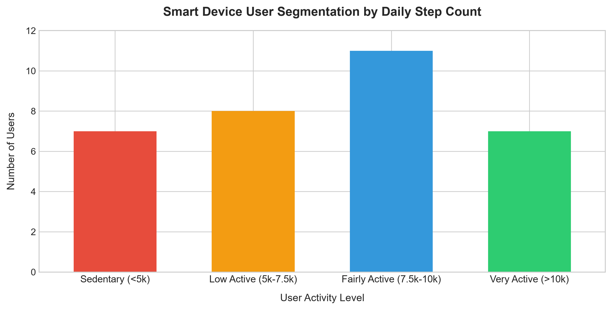

# 🌸 Bellabeat Wellness: Data-Driven Growth for Women's Smart Devices
**Google Data Analytics Professional Certificate - Capstone Case Study (Track A)**  
**Author:** Danny ([@xylaes](https://github.com/xylaes))  
**Tools Used:** R (`tidyverse`, `lubridate`, `janitor`, `scales`, `ggplot2`), Python (`pandas`, `matplotlib`), Kaggle, GitHub  
**Dataset:** FitBit Fitness Tracker Dataset (CC0 Public Domain via Mobius, 33 Active Users, 410 Merged Activity & Sleep Records)  
**Live Interactive Notebook:** [Kaggle Notebook](https://www.kaggle.com/code/dannyriggleman/bellabeat-wellness-women-s-smart-device-analytics)

---

## 📌 Executive Summary
Bellabeat is a high-tech wellness company founded in 2013 by **Urška Sršen** and **Sando Mur** that designs smart health products specifically tailored for women. Their ecosystem includes the **Bellabeat App**, the **Leaf** (jewelry tracker), the **Time** (hybrid wellness watch), the **Spring** (smart hydration bottle), and the **Bellabeat Membership** (subscription health coaching).

Urška Sršen commissioned this analysis to understand how consumers use non-Bellabeat smart devices in their daily lives. By uncovering behavioral trends in activity, sedentary time, and sleep, Bellabeat can optimize its app features, improve hardware marketing, and drive subscription growth.

---

## 🎯 The Business Task & Stakeholders
* **Core Questions:**
  1. What are the key trends in smart device usage?
  2. How do these trends apply to Bellabeat's target audience of wellness-focused women?
  3. How can these insights influence Bellabeat's marketing strategy and product ecosystem?
* **Primary Stakeholders:** Urška Sršen (Cofounder & CCO), Sando Mur (Cofounder & Mathematician), Bellabeat Executive Leadership.
* **Secondary Stakeholders:** Bellabeat Marketing Analytics Team.

---

## 🔍 Data Source & ROCCC Limitations

The analysis utilizes the public **FitBit Fitness Tracker Data** (April 12, 2016 to May 12, 2016) containing minute- and daily-level output on steps, activity intensities, calories, and sleep.

### ROCCC Framework Evaluation:
* **Reliability:** Medium - Data from 33 consenting Fitbit users via Amazon Mechanical Turk.
* **Originality:** Low - Secondary data collection aggregated by Mobius on Kaggle.
* **Comprehensiveness:** Medium - Rich biometric metrics, but missing demographic and female-specific health markers (e.g., menstrual cycle, pregnancy, stress).
* **Currency:** Low - Collected in 2016 (smart device capabilities have expanded since).
* **Citation:** CC0 Public Domain.

---

## 📊 Key Findings & Visual Insights

### 1. Daily Steps vs. Calories Burned (Positive Correlation)
* **Finding:** Strong positive linear correlation ($r = +0.59$) between total daily steps and calories burned.
* **Benchmark:** Average user logs **7,638 steps/day**, falling short of the CDC-recommended 10,000 steps.



---

### 2. Sedentary Time vs. Sleep Duration (The Sedentary Penalty)
* **Finding:** Significant negative correlation ($r = -0.60$) between daily sedentary minutes and sleep duration.
* **Insight:** The more hours users spend sitting during the day, the less sleep they obtain at night.



---

### 3. The 24-Hour Day: 81.3% Sedentary Reality
* **Sedentary Minutes:** **~991 mins (16.5 hours/day)** (81.3% of the day).
* **Lightly Active Minutes:** **~193 mins (3.2 hours/day)** (15.8%).
* **Fairly & Very Active:** **~35 mins total** (<3% of the day).



---

### 4. Smart Device User Segmentation
* **Sedentary (<5,000 steps):** ~21% of users
* **Low Active (5,000 to 7,499 steps):** ~30% of users
* **Fairly Active (7,500 to 9,999 steps):** ~27% of users
* **Very Active (10,000+ steps):** ~21% of users
* **Summary:** Over **51% of users** take fewer than 7,500 steps/day.



---

### 5. Sleep Tracking Discrepancy & Sleep Latency
* **Wearability Drop-Off:** 33 users logged daily activity, but **only 24 users (~68%) logged sleep data**. Over 30% of users remove their smartwatches before bed due to wrist discomfort or overnight charging.
* **Sleep Latency:** Users spend an average of **458 minutes in bed**, but only **419 minutes asleep** - losing **~39 minutes tossing and turning**.

---

## 💡 Top 3 Actionable Strategic Recommendations

### 1. Build an In-App "Activity-to-Sleep" Feedback Loop
* **Insight:** Prolonged daytime sedentary behavior reduces nighttime sleep duration ($r = -0.60$).
* **Strategy:** Introduce smart inactivity notifications in the Bellabeat App. When the app detects 2+ consecutive hours of sitting, send a gentle nudge: *"A 10-minute walk now helps you fall asleep 20 minutes faster tonight!"*

### 2. Market the Leaf Tracker as "Sleep-Friendly Jewelry"
* **Insight:** ~32% of consumers do not wear bulky smartwatches to sleep.
* **Strategy:** Position the **Bellabeat Leaf** (worn as a clip, necklace, or bracelet with a 6-month battery and no daily charging) as the ultimate non-intrusive sleep tracker that looks like fine jewelry rather than bulky wrist tech.

### 3. Bedtime Wind-Down Audio & Mindfulness (Membership Driver)
* **Insight:** Users lose an average of 39 minutes every night trying to fall asleep.
* **Strategy:** Trigger an automated **"Bedtime Routine"** in the Bellabeat App 30 minutes before target sleep, offering guided breathing exercises, ambient soundscapes, and sleep hygiene tips from Bellabeat Membership coaches to reduce sleep latency.

---

## 🛠️ Data Pipeline & Methodology
1. **Ask:** Defined the business task, stakeholders, and product goals for Bellabeat.
2. **Prepare:** Evaluated the FitBit dataset using the ROCCC framework and documented sample limitations.
3. **Process (R):** Cleaned timestamps, removed zero-step non-wear days, and merged activity and sleep tables via `inner_join`.
4. **Analyze (R):** Calculated descriptive statistics, correlation matrices, and 4-tier activity segmentation.
5. **Share:** Produced publication-grade visualizations in `ggplot2` and `matplotlib`.
6. **Act:** Formulated executive marketing and product recommendations for Urška Sršen.

---

## 📂 Repository Contents
```
├── README.md                  # Executive summary & visual findings
├── bellabeat_case_study.Rmd   # Reproducible R Markdown case study report
├── bellabeat_case_study.ipynb # Jupyter/Kaggle notebook (R Kernel)
├── kernel-metadata.json       # Kaggle CLI deployment configuration
└── visuals/                   # Publication charts (PNG)
    ├── 01_steps_vs_calories.png
    ├── 02_sedentary_vs_sleep.png
    ├── 03_activity_intensity_distribution.png
    └── 04_user_segmentation.png
```
